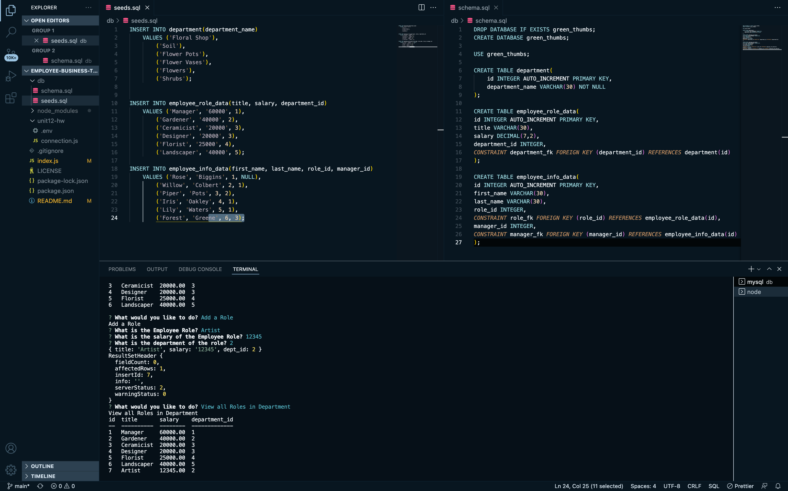
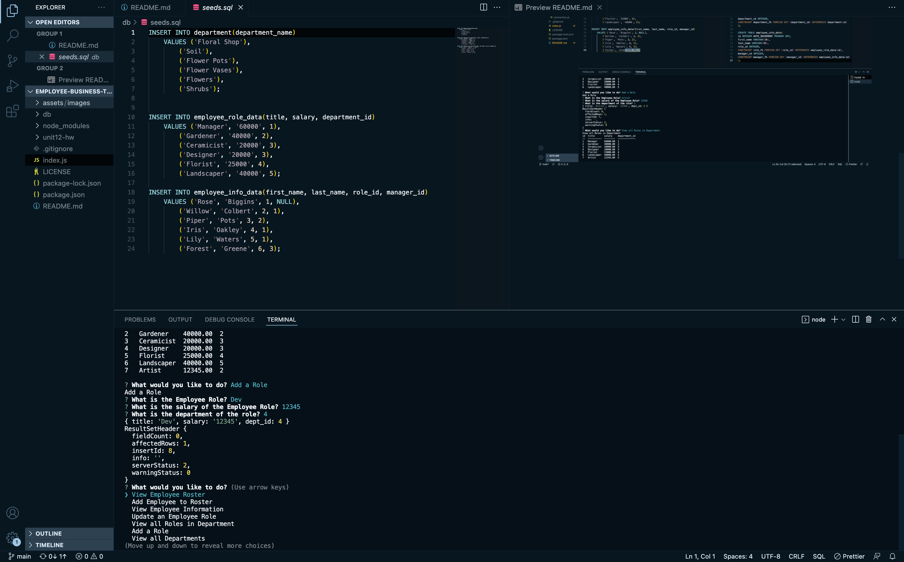

# Employee Business Tracker
----

----

### Welcome to the Employee Business Tracker Application!

#### This application can help business owners, as well as managers keep track  of staff and roles assigned per employee. Using this employee tracker you can do a number of things including:

* View Employee Roster
* Add a new Employee to Roster
* Update Exisiting Employee to Roster
* View all Departments
* View all Roles
* Add a new Role 
-----
#### Tables are a great way to help visulalize and see data in front of you. To use this application is easy and simple! The user will be prompted with a series of questions inquiring what they would like to do exactly from the choices given (above). Depending on the selection, the user will be asked to input specific types of data in order to add or update employee information to each table. Once finished, the user can view each table and see the changes made.
----
## Lanugages Used:
* NODE JS
* MYSQL
* MYSQL2
* INQUIRER
* DOTENV

## [GitHub Repository Link](https://github.com/jadehuynh/employee-business-tracker)
## [Live Video Link](https://youtu.be/-6dNSefL1kc)
----
## Employee Business Tracker Image

----

